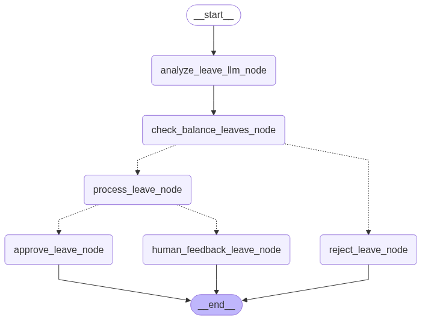

# 🤖 Leave Application AI Agent

An intelligent, full-stack leave processing system powered by AI that automates leave application analysis, approval workflows, and decision-making for corporate environments, schools, government offices, and any organization that handles employee leave requests.



## Demo Video

<iframe width="560" height="315" src="https://www.youtube.com/embed/AxBa5KolX-4?si=ZLSt-ei44mONJHXO" title="YouTube video player" frameborder="0" allow="accelerometer; autoplay; clipboard-write; encrypted-media; gyroscope; picture-in-picture; web-share" referrerpolicy="strict-origin-when-cross-origin" allowfullscreen></iframe>

## 🌟 Features

### 🧠 AI-Powered Intelligence

- **Smart Leave Classification**: Automatically categorizes applications as MEDICAL or CASUAL using Google Gemini 2.0 Flash
- **Natural Language Processing**: Understands leave requests written in natural language
- **Intelligent Date Extraction**: Automatically parses start dates, end dates, and calculates leave duration
- **Context-Aware Responses**: Generates personalized replies for applicants

### ⚡ Automated Workflow

- **Multi-Step Decision Process**: Uses LangGraph for sophisticated workflow orchestration
- **Leave Balance Validation**: Checks available leave balance before processing
- **Smart Auto-Approval**: Single-day medical leaves are automatically approved
- **Human-in-the-Loop**: Complex cases are routed to human reviewers
- **Instant Rejection**: Applications exceeding balance are automatically rejected with explanations

### 🔧 Technical Excellence

- **RESTful API**: FastAPI-based backend with comprehensive CORS support
- **Scalable Architecture**: Modular design suitable for enterprise deployment
- **Type Safety**: Structured outputs using Pydantic models
- **State Management**: LangGraph handles complex workflow states
- **Production Ready**: Built with modern Python practices and UV package management

## 🏗️ Architecture

## 🚀 Quick Start

### Prerequisites

- Python 3.11 or higher
- UV package manager
- Google API key for Gemini

### Installation

1. **Clone the repository**

   ```bash
   git clone <repository-url>
   cd leave-application-agent
   ```

2. **Set up the backend**

   ```bash
   cd backend
   cp .env.example .env
   # Add your Google API key to .env file
   uv sync
   ```

3. **Run the server**

   ```bash
   uv run python main.py
   ```

   The server will start on `http://localhost:7007`

4. **Test the API**
   ```bash
   curl -X POST "http://localhost:7007/leaves/apply" \
        -H "Content-Type: application/json" \
        -d '"I need medical leave for 2 days starting from June 1st due to fever"'
   ```

## 🛠️ Project Structure

```
leave-application-agent/
├── backend/
│   ├── main.py                 # FastAPI application entry point
│   ├── agents/
│   │   └── agentWorkflow.py    # AI agent workflow implementation
│   ├── pyproject.toml          # Project dependencies and metadata
│   ├── uv.lock                 # Lockfile for reproducible builds
│   └── .env.example            # Environment variables template
├── frontend/                   # Next.js UI (Coming Soon)
├── docs/
│   └── leave-agent.png         # Workflow diagram
└── README.md                   # This file
```

## 🔧 Configuration

### Environment Variables

Create a `.env` file in the backend directory:

```env
GOOGLE_API_KEY=your_google_api_key_here
```

---

**Built with ❤️ using FastAPI, LangChain, LangGraph, and Google Gemini AI**
